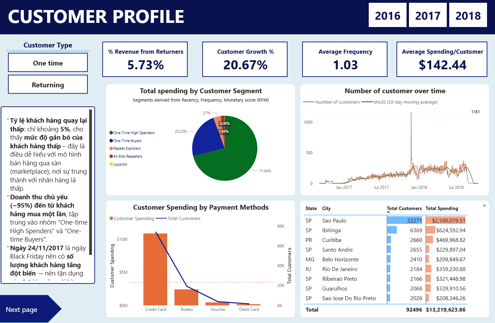
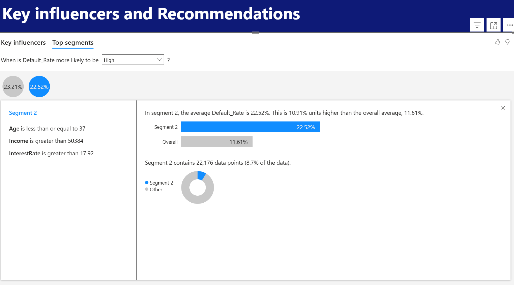

# Thach's Portfolio
This repository contains my portfolio of data analytics projects, including Power BI dashboards, Python, and business case studies. 
## Projects 
### [Brazilian E-commerce Analysis of Olist Store](./projects/brazilian-ecommerce)
- **Tool**: Power BI
- **Key Insights**: 
  - Bad ratings are due to late deliveries and 'false' product description
  - Over 95% customers are one-time buyers
- **Highlights**: Business recommendations to improve retention, logistics, and product information  

### [Loan Default](./projects/loan-default)
- **Tool**: Power BI
- **Key Insights**: 
  - Income level, age and interest rate were the strongest predictors of default
  - Demographic factors such as high school education, unemployment, less than 1 year of experience, and divorced status were associated with a higher default rate.
  - Customers with high loan amounts, no mortgage history, and no co-signer also showed higher risk of default.
- **Highlights**: Used Power BI Key Influencers visual to derive actionable recommendations - for instance, customers with income > $50,000, but age < 37, and interest rate > 17.92% had a default rate of 22.52%, nearly double the average (11.61%).

