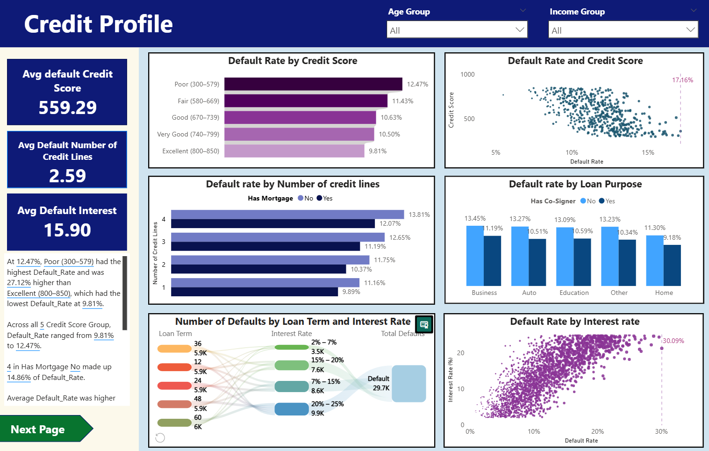

# Thach's Portfolio
This repository contains my portfolio of data analytics projects, including Power BI dashboards, Python, and business case studies. 
## Table of Contents
- [Projects (Python + Power BI)](#projects-python--power-bi)
  - [Apartment Price in Hanoi](#apartment-price-analysis-in-hanoi).
- [Projects (Power BI)](#projects-power-bi)
  - [Brazilian E-commerce Analysis of Olist Store](#brazilian-e-commerce-analysis-of-olist-store)
  - [Loan Default](#loan-default)
## Projects (Python + Power BI)
### [Apartment Price Analysis in Hanoi](./projects/apartment_price)
- **Tools**: Python (Crawl, Clean, EDA) & Power BI  
- **Key Insights**:
  - Apartment prices in **urban districts** are significantly higher than in suburban areas.  
  - The **highest average price** per square meter is observed in **Tây Hồ and Ba Đình**.  
- **Highlights**:
  - Data was **crawled from the Alonhadat real estate website** on **October 16, 2025**, containing ~2,000 raw listings before cleaning.  
  - The dataset represents a **sample for exploratory analysis**, not the full Hanoi real estate market.  

  
## Projects (Power BI)
### [Loan Default](./projects/loan-default)
- **Tool**: Power BI
- **Key Insights**: 
  - Income level, age and interest rate were the strongest predictors of default
  - Demographic factors such as high school education, unemployment, less than 1 year of experience, and divorced status were associated with a higher default rate.
  - Customers with high loan amounts, no mortgage history, and no co-signer also showed higher risk of default.
- **Highlights**: Used Power BI Key Influencers visual to derive actionable recommendations - for instance, customers with income > $50,000, but age < 37, and interest rate > 17.92% had a default rate of 22.52%, nearly double the average (11.61%).

