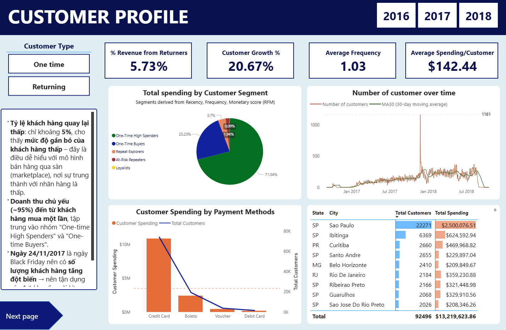

# Brazilian E-commerce Data Analysis

## Overview
Real-world marketplace dataset from Olist store in Brazil in 2016–2018  
Goal - understand customer behavior and experience to improve quality

## Objectives
- Track order and sales trends over time  
- Profile customers (one-time vs. returning)  
- Assess delivery performance and customer ratings  
- Detect risk factors for low reviews  
- Recommend business actions for retention and logistics optimization  

## Key dashboards

## Insights summary
- **Late deliveries** average 6.77%. While not extreme, they significantly reduce customer ratings, especially in peak periods.  
- **One-time buyers dominate** (~95%). Very few customers are loyal or repeat buyers.  
- **Low ratings (1–2 stars)**: over 60% are linked to late or undelivered orders. Categories like **Bed Bath Table** and **Health Beauty** show the highest concentration of bad reviews.  
- **Voucher payment** has high risk: cancellation rate 2.43%, higher than credit/debit cards (~0.5%).  

## Recommended actions
- Build a simple brand site for direct retention and remarketing
- Prioritise SLA for high distance routes and peak months
- Improve product pages – clearer descriptions and realistic photos.
- Audit logistics partners; prioritize reliable couriers.  
- Add real-time alerts for orders at risk of delays. 
- Focus on growing **Health & Beauty** and **Watches & Gifts** to increase order value.  

## Files
- README.md – this document
- brazil_overview.png – KPI overview
- brazil_performance.png – delivery and service performance
- brazil_customer_exp.png – experience and review metrics
- brazil_customer_pro.png – customer profile and cohort views
- brazil_bad_ratings.png – negative review drilldown
- insights.png – executive summary slide

## Contact
- LinkedIn  [linkedin.com/in/ngọc-thạch-đặng](https://www.linkedin.com/in/ng%E1%BB%8Dc-th%E1%BA%A1ch-%C4%91%E1%BA%B7ng-5694a1308/)
- Email  [thach.ngocdang25@gmail.com](mailto:thach.ngocdang25@gmail.com)

